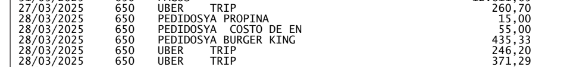
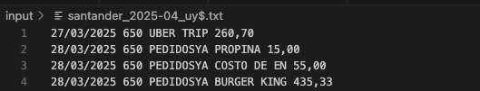

# Analisis Gastos Tarjetas de Crédito

## Doc en español:

## Acerca de
Creé este proyecto para poder analizar en detalle, los gastos que realizo mes a mes, con mis tarjetas de crédito.<br>
Cada banco me envía el estado de cuenta en un PDF por mail.
Con este proyecto, parseo esos datos a formato JSON, los persisto, y posteriormente los uso, para clasificar por categorias, 
y poder analizar en que gasto mas dinero. De esta forma puedo optimizar al máximo mis finanzas personales.

## Empezando:

### Pre-requisitos:
- Python 3.10 instalado en tu sistema.

### Instalacion y setup:
1. Clonar el repo de GitHub
2. Crear el VENV con las dependencias.
3. Crear las siguientes variables de entorno:
    - `PASSW_APPLICATION_EMAIL` Password de aplicaciones de Google, para el envio de mail.
    - `SENDER_EMAIL` Mail que enviará el mail con el reporte.
    - `RECEIVER_EMAIL` Mail que recibe el informe (puede ser el mismo mail que arriba)

    En Linux:
    ```bash
    export PASSW_APPLICATION_EMAIL="tu_passw"
    export SENDER_EMAIL="tu_sender@example.com"
    export RECEIVER_EMAIL="tu_receiver@example.com"
    ```
4. Correr este script para crear el VENV con las dependencias necesarias.
```bash
./setup.sh
```
El setup, también corre el proyecto. Se puede correr solo el proyecto, con este sh: 
```bash
./run.sh
```

## Úso:

1. Ir al PDF que tu banco te envia por Mail, con el estado de cuenta de cada mes.

2. Crear en la carpeta `input/` un archivo de la forma: `{banco}_{año}-{mes}_{moneda}.txt`<br><br>
    Ejemplos: 
    - santander_2025-04_uy$.txt
    - santander_2024-12_usd.txt
    - itau_2025-01_uy$.txt

3. Dirigirse al PDF en cuestión enviado por el banco<br>


4. Copiar todo el contenido únicamente de esas líneas (fecha, concepto, importe) y únicamente con los conceptos de la modeda elegida.

5. Pegar el texto en el archivo creado previamente en el paso (2)<br>
    

6. Ejecutar el proyecto: `./run.sh`

<br><br>
---

## Manual in english:

## About The Project:
TO-DO...

## Getting Started

### Prerequisites:
- Python 3.10 installed in your system.

### Installation:
1. Clone the repo from GitHub.
2. Create the VENV with dependencies.
3. Create next environment variables:
    - `PASSW_APPLICATION_EMAIL` Password from Google Applications, from mail sender.
    - `SENDER_EMAIL` Email sender
    - `RECEIVER_EMAIL` Email receiver the report. (It can be the same email as the sender)

    In Linux:
    ```bash
    export PASSW_APPLICATION_EMAIL="your_passw"
    export SENDER_EMAIL="your_sender@example.com"
    export RECEIVER_EMAIL="your_receiver@example.com"
    ```
4. Run setup script for create the VENV with all necesaries dependencies.
```bash
./setup.sh
``` 
The setup script also runs the project. You can run just the project with this shell script:
```bash
./run.sh
```

## Usage manual:

1. Go to the PDF that your bank sends you by email, with each month's statement.

2. Create a file in the `input/` folder with this format: `{bank-name}_{year}-{month}_{currency}.txt`<br><br>
    Ejemplos: 
    - santander_2025-04_uy$.txt
    - santander_2024-12_usd.txt
    - itau_2025-01_uy$.txt

3. Go to the PDF sent by the bank<br>


4. Copy all the content from those lines only (date, concept, amount) and only with the concepts of the chosen mode.

5. Paste the text into the file previously created in step (2)<br>
    

6. Run the project: `./run.sh`

## Roadmap
- [x] Version 0.0.1
- [ ] Use SQL database as storage instead of json files.
- [ ] Add new metrics, reports, comparisons, integration with different accounts from several banks.
- [ ] Automate data uploads from bank PDFs or emails with AI.

## Contact:

[joaquin.p.olivera@gmail.com](mailto:joaquin.p.olivera@gmail.com)

## 📄 License

This project is licensed under the [MIT License](LICENSE).

---
